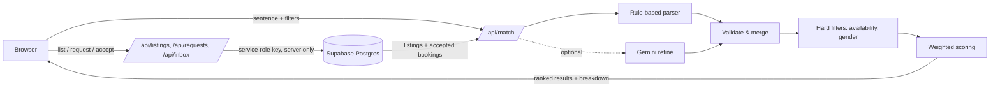

# OneWear

**Rent the outfit, not the wardrobe.** Describe your occasion in one sentence and OneWear finds outfits that people near you in Chennai are lending, in your size, within your budget, and free on your date.

Built for **HACKXPRESS 1.0, Problem Statement 4: Resource-Intensive Consumer Culture & Environmental Impact** ("Wear Once, Don't Buy").

**Live demo:** `https://<your-project>.vercel.app`

---

## The problem

People buy expensive clothes for one occasion (weddings, interviews, parties, photoshoots, college events) and then never wear them again. That wastes money, and every new garment costs thousands of litres of water and kilograms of CO₂ to produce. Rental stores exist, but they hold their own central stock. The outfits already sitting unused in wardrobes across a city are never matched to the people who need them next week.

## What OneWear does

1. **Occasion-first search.** Type *"Cousin's sangeet in Anna Nagar next Saturday, size M, under ₹900, nothing too loud"*. OneWear extracts the occasion, size, budget, date, area and the look you want.
2. **Explainable matching.** Every result shows a match percentage and a per-factor breakdown (occasion, size, distance, budget, style), so you know exactly why it ranked there.
3. **Availability with a cleaning buffer.** Each booking blocks an outfit from 1 day before the event (pickup) to 2 days after (return and dry-cleaning). Clashing outfits are hidden automatically.
4. **Rental request flow.** Shows the pickup, event, return and cleaning timeline, the rental fee, the refundable deposit, and the estimated water, CO₂ and money saved versus buying new.
5. **Lend an outfit with a photo.** A validated listing form with photo upload. Phone photos (often 3 to 8 MB) are shrunk in the browser to about 300 KB before upload, then stored in Supabase Storage. The server checks each file's actual bytes, so a renamed non-image is rejected.
6. **SMS alerts.** Texts go out automatically when someone requests an outfit (to the lender, plus a confirmation to the borrower), when the lender accepts or declines (to the borrower, including the lender's number to arrange pickup), and when an accepted booking is cancelled (to the lender). The screen confirms each text with the number masked to its last 4 digits. A failed text never blocks a rental.
7. **Lender inbox.** Accept or decline requests. Accepting reveals the borrower's phone number, blocks the dates, and automatically declines other requests that would clash.
8. **My rentals and impact.** Tracks each request's status (waiting, accepted, declined), lets you cancel, and totals the water, CO₂ and money saved by renting instead of buying.

The app runs in two modes. **Shared mode** (Supabase connected): listings and requests are stored in a Postgres database and shared between all users. **Browser-only mode** (no database keys): everything works on one device using browser storage, so the demo never breaks if the database is unavailable.

## How matching works

```
score = 0.30 × occasion + 0.25 × size + 0.20 × distance + 0.15 × budget + 0.10 × style
```

| Factor | Weight | Scoring |
|---|---|---|
| Occasion | 30% | 1.0 if tagged for the occasion, 0.5 if a related occasion, else 0 |
| Size | 25% | 1.0 exact, 0.4 one size away (alteration), else 0 |
| Distance | 20% | Linear from 1.0 at 0 km to 0 at 25 km (haversine distance) |
| Budget | 15% | 1.0 within budget, falls to 0 at 25% over |
| Style | 10% | Share of requested looks matched, plus garment-type match |

Unspecified factors get a neutral 0.7. Hard filters (availability, who it's for) run before scoring. Ties break on distance, then price. The full explanation is also on the `/how` page of the app.

**AI with a safety net.** A deterministic rule-based parser always runs. If `GEMINI_API_KEY` is set, Gemini also reads the sentence; its output is validated against the same allowed values and merged in. If the AI is missing, slow (4 s timeout) or returns invalid JSON, the rule-based result is used. Search never fails because of the AI.

## Architecture



### API

| Route | Method | Purpose |
|---|---|---|
| `/api/match` | POST | Parse a sentence, filter, score and rank outfits |
| `/api/listings` | GET / POST | Your listings / create a listing |
| `/api/listings/:id` | DELETE | Remove your own listing |
| `/api/requests` | GET / POST | Your rental requests / request an outfit |
| `/api/requests/:id` | PATCH | `cancel` (borrower), `accept` or `decline` (lender) |
| `/api/inbox` | GET | Requests for your outfits |
| `/api/status` | GET | Whether the database, AI and SMS are connected |

### Data model

`listings` holds each outfit with its sizes, occasions, price, deposit, area, and the hashed owner key. `requests` holds each rental request with a snapshot of the outfit, the event date, the borrower's name and phone, and a status (`pending`, `accepted`, `declined`, `cancelled`). Full schema: [`supabase/schema.sql`](supabase/schema.sql).

## Tech stack

- **Next.js (App Router)**: frontend and API routes in one project, deployed on Vercel
- **Supabase (Postgres + Storage)**: shared listings and requests, and outfit photos
- **Twilio**: SMS notifications (optional)
- **Plain JavaScript and CSS**: no UI framework, CSS-drawn fabric swatches instead of images
- **Google Gemini** (optional): natural-language refinement
- **Node's built-in test runner**: unit tests for parsing, scoring and validation

## Project structure

```
app/
  page.js              Find an outfit (search, refine, results, booking)
  list/page.js         Lend an outfit (validated form)
  rentals/page.js      My rentals: request status + personal impact totals
  inbox/page.js        Lender inbox: accept / decline requests
  how/page.js          How matching works
  api/match/route.js   Parse → filter → score → rank
  api/listings/        Create, list and delete listings
  api/requests/        Create, list, cancel, accept, decline requests
  api/inbox/           Requests for the caller's outfits
  api/status/          Which services are connected
components/            Header, ResultCard, BookingDialog, Swatch
lib/
  parser.js            Rule-based sentence parser
  llm.js               Optional Gemini refinement with timeout + fallback
  scoring.js           Weights, availability buffer, ranking
  validate.js          Server-side sanitisation of all input
  listings.js          Seed inventory (36 outfits across Chennai)
  areas.js             Neighbourhood coordinates + haversine distance
  catalog.js           Shared vocabulary (sizes, occasions, styles, impact)
  db.js                Supabase queries and photo storage (server only)
  sms.js               Twilio SMS sender that never throws
  messages.js          Wording of every SMS
  image.js             In-browser photo shrinking
  smsSummary.js        On-screen SMS confirmation text
  identity.js          Device-key hashing for ownership
  api.js               Browser-side fetch helper
  http.js              Shared API response helpers
  rateLimit.js         Per-IP request limiting
  storage.js           Guarded localStorage helpers
tests/                 24 unit tests
supabase/schema.sql    Database tables, constraints, indexes, RLS, photo bucket
supabase/migration-002-photos-sms.sql  Update for existing databases
supabase/demo-data.sql Demo listings and requests
```

## Security and error handling

- **Database locked down:** Row Level Security is on with no public policies, so the public Supabase key can read or write nothing. Only the server, holding the secret service-role key in an environment variable, can reach the data
- **Ownership checks on every write:** only a lender can accept or decline requests for their outfit, only a borrower can cancel their own request, and only an owner can delete a listing
- **Device keys are hashed** (SHA-256) before storage, so database rows can't be used to impersonate anyone
- **Contact privacy:** phone numbers are exchanged only after a lender accepts. The lender's number is stored in a private column that is never included in public listing data, and on-screen SMS confirmations show only the last 4 digits
- **Photo safety:** uploads are limited to JPG, PNG and WebP under 700 KB, checked by their file signature rather than their name. The storage bucket is public to view but only the server can upload or delete
- **Race-safe status changes:** a request only changes if it's still in the expected state, so double clicks or two devices can't both accept
- **No double booking:** availability is rechecked on request and again on accept; clashing pending requests are auto-declined
- Every API input is validated on the server; database constraints enforce the same rules a second time
- Per-IP rate limiting, request size limits, and security headers on every response
- AI calls have a timeout and full fallback; the app falls back to browser-only mode if the database isn't configured
- UI handles loading, empty, offline and error states with specific guidance

## Run locally

```bash
npm install
npm run dev        # http://localhost:3000
npm test           # 24 unit tests
```

Copy `.env.example` to `.env.local` and fill in whichever services you want. With nothing set, it runs in browser-only mode.

## Connect Supabase

1. Create a free project at [supabase.com](https://supabase.com).
2. Open **SQL Editor → New query**, paste the contents of `supabase/schema.sql`, and click **Run**.
3. Open **Project Settings → API** and copy the **Project URL** and the **service_role** secret key.
4. In Vercel: **Project → Settings → Environment Variables**, add `SUPABASE_URL` and `SUPABASE_SERVICE_ROLE_KEY`, then redeploy.
5. Check `https://<your-project>.vercel.app/api/status` shows `"db":true`.
6. For photos and SMS, also run `supabase/migration-002-photos-sms.sql` once in the SQL Editor.
7. Optional demo data: `supabase/demo-data.sql` (instructions inside the file).

## Connect SMS (optional)

1. Sign up at [twilio.com](https://www.twilio.com) and get a phone number from the console.
2. On a free trial, verify each phone that should receive texts (Phone Numbers → Verified Caller IDs).
3. Add `TWILIO_ACCOUNT_SID`, `TWILIO_AUTH_TOKEN` and `TWILIO_FROM_NUMBER` in Vercel and redeploy. `/api/status` then shows `"sms":true`.

Production note: sending SMS to Indian numbers at scale requires DLT registration with TRAI and an Indian SMS provider. The SMS code is isolated in `lib/sms.js` so the provider can be swapped.

## Deploy

Import the repo on [vercel.com](https://vercel.com) → Framework: Next.js → Deploy. Add environment variables as described above.

## Prototype limits and next steps

- **Identity:** ownership uses a random per-browser key rather than accounts. Clearing browser data loses access to your listings. Next: Supabase Auth with phone OTP.
- **Photos:** one photo per outfit. Next: several photos per outfit and a close-up of the fabric.
- **Payments:** rent and deposit are paid at pickup. Next: UPI deposit escrow through a payment gateway, released on return.
- **Trust:** before/after condition photos for damage disputes, and ratings for lenders and borrowers.
- **Notifications:** SMS runs on a Twilio trial. Next: DLT-registered Indian SMS sender and WhatsApp messages.
- **Launch plan:** college campuses first, where events create repeat demand in a small radius, plus local boutiques that already rent informally.

## Business model

A 15% commission on each rental, plus a membership that waives deposits and gives early access to high-demand outfits during wedding season.
